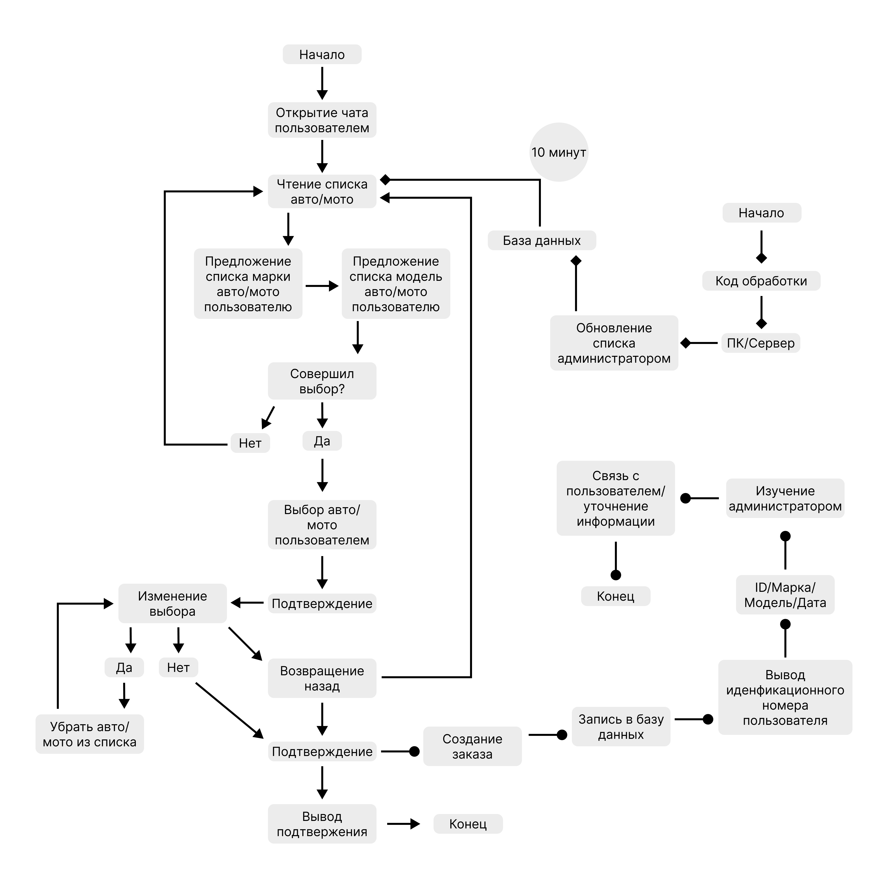

#  ArendAuto

## Запуск проекта
Если репозиторий с ботом был впервые загружен на ваш ПК, то перед началом разработки например (pychram) попросит установить библиотеки, которые прописаны в файле "requirements.txt". Или поставьте их вручную, так же открыв файл "requirements.txt".

Для запуска бота необходимо запустить файл "ArendAuto.py". Но перед этим, прописать в файле "create_bot.py" свой личный токен

  

## Структура бота (проекта)

  

## Ссылка на бота в Telegram
<a href="http://t.me/ArednAuto_bot">➡️<b>КНОПКА</b>⬅️</a>

## Благодарность
Спасибо команде <a href="https://pentagonchik.ru/">ITШники</a>, которая выполнила большую часть работы с кодом.